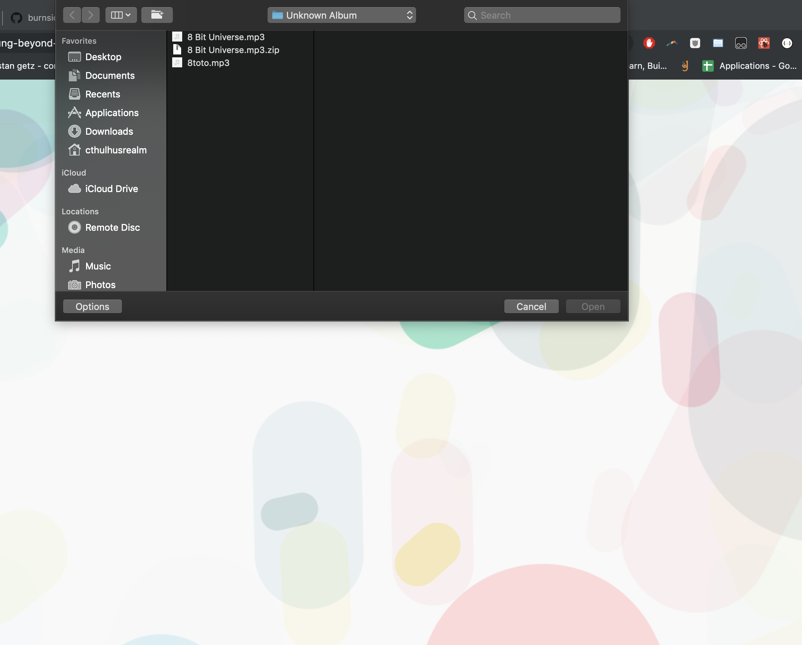
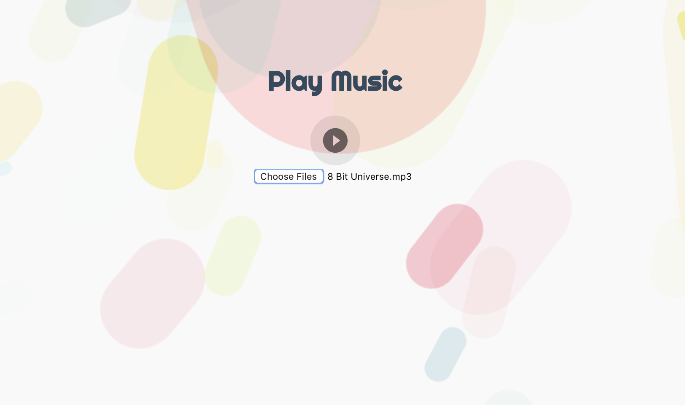
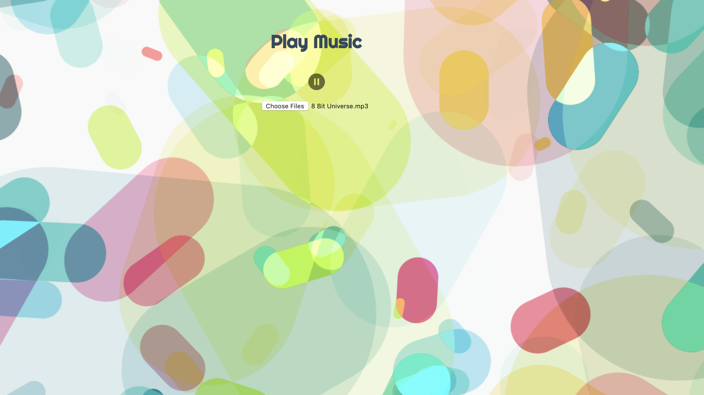

# React Music Player
A React based app for listening to your favorite music.

## Table of Contents
- [Usage](#usage)
- [Support](#support)

## Usage

-Open https://young-beyond-10080.herokuapp.com/

-Select a song locally on your device

-Once song is selected, press play to watch the visualization.

-Enjoy your music!!

## Support

Please [open an issue](https://github.com/burnsidion/React-Music-Player/issues) for support.
